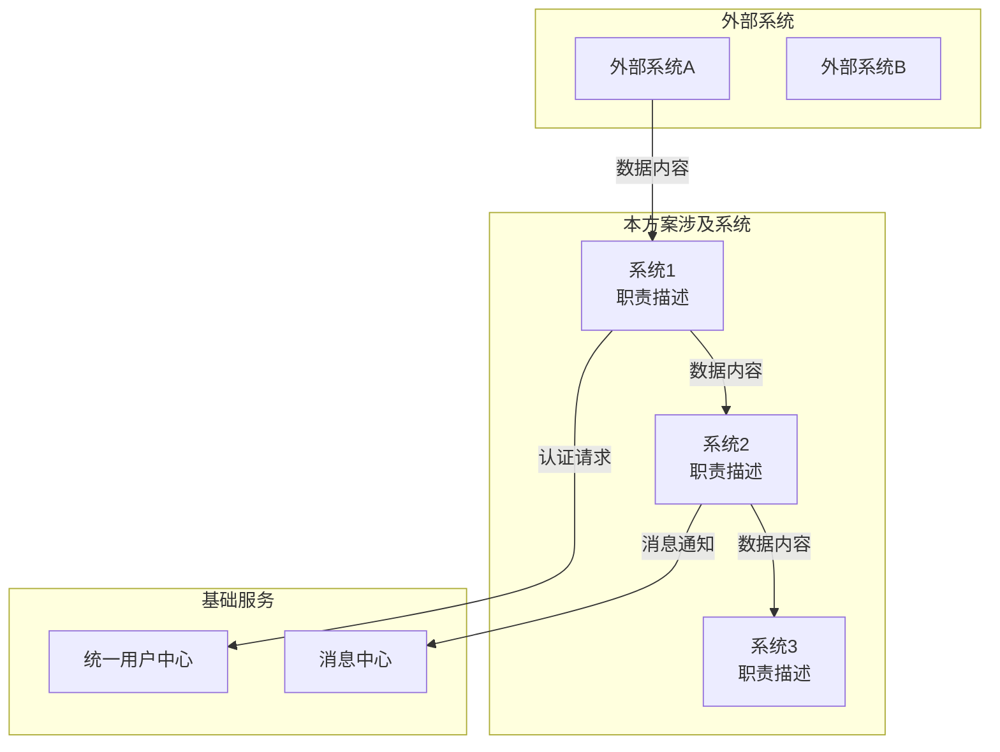
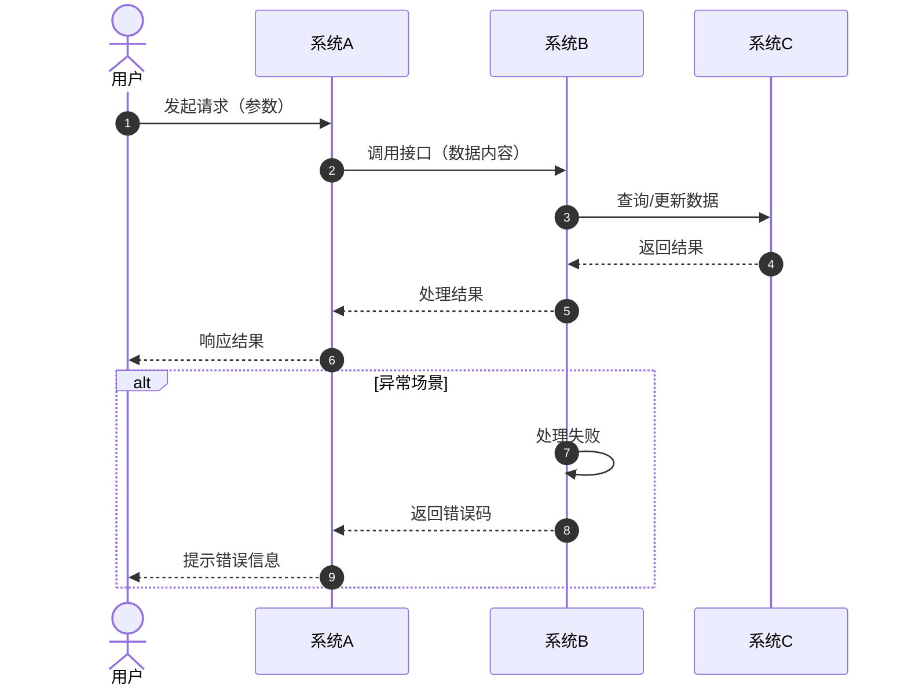

# 应用系统与数据交换讨论助手

本文件为 architecture-solution-writer skill 的子技能模块，用于在生成第5章"应用架构"的5.1总体设计时，与用户进行交互式讨论，梳理应用系统列表、系统间数据交换关系，并生成架构设计图和核心流程图。

## 触发条件

在生成第5章 5.1 总体设计时，如果用户未提供完整的应用架构图或系统交互关系说明，则加载本助手进行补充讨论。

## 讨论目标

1. 明确本方案涉及的所有应用系统（含新建、变更、关联系统）
2. 梳理系统间的数据交换关系（接口方向、数据内容、交换频率）
3. 确定核心业务流程的系统交互路径
4. 生成可供插入文档的架构设计图和流程图

## 讨论流程

### 第一轮：识别应用系统

使用 AskUserQuestion 询问：

```
为了绘制应用架构图，请先明确以下信息：

1. 本方案涉及哪些应用系统？请列出系统名称和简称。
   - 新建系统：
   - 变更系统：
   - 关联系统（仅接口调用）：

2. 每个系统的核心业务职责是什么？（一句话描述）

3. 是否有现有架构图或系统清单文档可以参考？如有请上传。
```

### 第二轮：梳理数据交换关系

根据第一轮收集的系统列表，逐一询问系统间的数据交换：

```
请描述以下系统间的数据交换关系：

【系统A】与【系统B】之间：
1. 是否有数据交换？（是/否）
2. 数据流向：A→B / B→A / 双向？
3. 交换的数据内容是什么？（如：订单数据、用户信息、状态通知等）
4. 交换方式：实时同步 / 异步消息 / 定时批量 / 文件传输？
5. 使用的协议：HTTP/HTTPS / RPC / MQ / 其他？
```

对每对存在交互的系统组合进行询问，直到覆盖所有关键交互路径。

### 第三轮：确认核心业务流程

```
请描述本方案的核心业务流程（1-3个最关键的流程）：

流程1：【流程名称】
- 触发场景：
- 涉及系统：系统A → 系统B → 系统C
- 每个步骤的数据变化：
- 异常处理路径：

是否需要补充其他核心流程？
```

### 第四轮：确认图表需求

```
根据讨论结果，将为您生成以下图表插入到5.1总体设计中：

1. 【应用逻辑架构图】：展示所有系统及其交互关系
2. 【核心流程图1】：【流程名称】
3. 【核心流程图2】：【流程名称】（如有）

请确认：
- 是否需要调整系统列表或交互关系？
- 是否需要补充其他流程图？
- 图表风格偏好：简洁线框 / 详细标注？
```

## 图表生成规范

### 应用逻辑架构图

使用 Mermaid 语法生成，格式如下：



**图表要求**：
- 使用 `graph TB`（从上到下）或 `graph LR`（从左到右）布局
- 系统节点使用方括号 `[系统名]`
- 关联系统使用不同颜色或线型区分（新建/变更/关联）
- 数据流向标注具体数据内容
- 外部系统和基础服务使用 subgraph 分组

### 核心业务流程图

使用 Mermaid 语法生成，格式如下：



**图表要求**：
- 使用 sequenceDiagram 时序图
- 标注步骤序号（autonumber）
- 明确标注调用参数和返回数据
- 包含正常流程和异常分支（alt/opt）
- 用户/外部系统使用 actor，内部系统使用 participant

## 图表插入文档规则

1. 在5.1总体设计章节中，架构图放在文字描述之后
2. 每个核心流程图在5.3核心场景验证中引用，并在5.1中简要提及
3. 图表使用 docx-js 的 ImageRun 插入，格式要求：
   - 图片居中显示
   - 图片下方添加图注（如"图5-1 应用逻辑架构图"）
   - 图注格式：宋体, sz: 21（五号）, 居中

## 图表转图片方法

由于 docx-js 无法直接渲染 Mermaid，使用以下方法转换：

1. 使用 Mermaid CLI 将 mermaid 代码转换为 SVG/PNG：
   ```bash
   npx @mermaid-js/mermaid-cli mmdc -i architecture.mmd -o architecture.png
   ```

2. 或使用在线 API 转换后下载插入

3. 在 skill 中，先生成 mermaid 代码文本，提示用户可基于此代码生成图表，同时用文字描述图表内容作为备选

## 输出格式

讨论结束后，输出结构化数据供主 skill 使用：

```yaml
systems:
  - name: 系统1
    short_name: SYS1
    type: 新建/变更/关联
    responsibility: 职责描述
  - name: 系统2
    short_name: SYS2
    type: 新建/变更/关联
    responsibility: 职责描述

data_exchanges:
  - from: 系统A
    to: 系统B
    data: 数据内容描述
    method: 实时同步/异步/批量
    protocol: HTTP/MQ/RPC

core_processes:
  - name: 流程名称
    steps:
      - system: 系统A
        action: 操作描述
        data_in: 输入数据
        data_out: 输出数据
      - system: 系统B
        action: 操作描述
        data_in: 输入数据
        data_out: 输出数据

mermaid_diagrams:
  architecture: |
    graph TB
      ...
  process_1: |
    sequenceDiagram
      ...
```

## 与主 skill 的集成点

本助手在以下时机被调用：

1. **触发时机**：主 skill 执行到第4步"逐章内容生成"，开始生成第5章 5.1 总体设计时
2. **调用方式**：主 skill 检查是否已有足够的系统信息和架构图描述
   - 如有：直接生成内容
   - 如不足：加载本助手，进行交互式讨论
3. **数据回传**：讨论结束后，将结构化数据（systems, data_exchanges, core_processes, mermaid_diagrams）回传给主 skill
4. **内容生成**：主 skill 将讨论结果整合到 5.1 总体设计的文字描述中，并插入生成的图表

## 注意事项

- 如果用户提供了现有架构图，使用 Read 工具读取后提取系统列表和交互关系，减少重复提问
- 对于用户不确定的系统交互，标记为"待确认"，在文档中注明
- 图表生成不是必须的，如果用户明确不需要图表，仅输出文字描述的系统交互关系即可
- 所有讨论内容需最终体现在5.1总体设计的文字描述中，图表作为辅助展示
